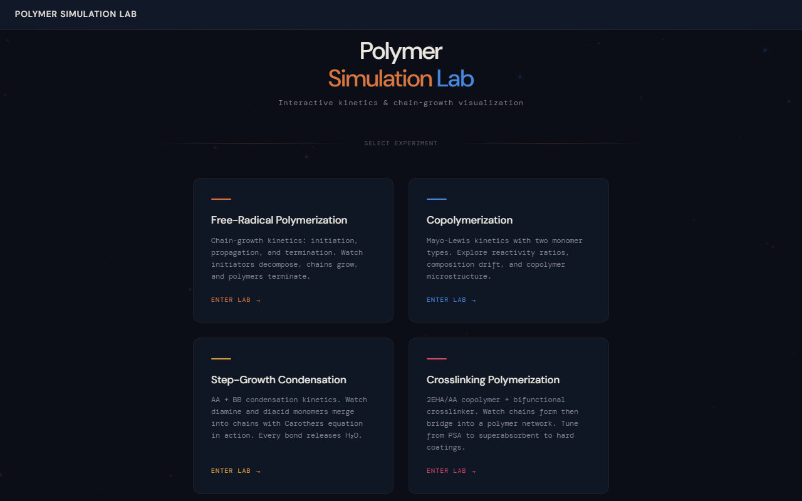

# Polymer Simulation Lab 🧪

**Interactive browser-based polymer science simulations for chemistry education.**

Watch polymerization happen at the molecular level — in real time, in your browser. Zero dependencies. Zero setup. Just open and play.



---

## What Is This?

Five interactive simulators that make polymer chemistry visible:

| Simulator | Mechanism | What You'll See |
|-----------|-----------|----------------|
| **[Free-Radical](./free-radical/)** | Chain-growth | Initiation → Propagation → Termination. Mn, Mw, PDI in real time. |
| **[Copolymerization](./copolymer/)** | Mayo-Lewis kinetics | Two monomers (2EHA + AA). Reactivity ratios, composition drift, Mayo-Lewis diagram. |
| **[Step-Growth Condensation](./step-growth/)** | AA + BB | Any molecule can react. Carothers equation, DP vs conversion, H₂O byproduct. |
| **[Crosslinking](./crosslink/)** | 3D network | 2EHA/AA copolymer + bifunctional crosslinker. Gel point detection. PSA/SAP/Coating/Hydrogel presets. |
| **[Aziridine Crosslinking](./crosslink/aziridine.html)** | Room-temp cure | Solvent-borne acrylic PSA + trifunctional aziridine. Flory-Stockmayer gel point. Self-contained single-page app. |

---

## How to Use

```bash
# Option A — Python (built-in, no install needed)
python -m http.server 8765

# Option B — Node.js
npx --yes serve -p 3456 -s .
```

Open `http://localhost:8765/` in any modern browser.

### For each simulator:

1. **Adjust sliders** — monomer ratio, reaction rate, initiator concentration, etc.
2. **Hit Play** — watch particles move and react in real time on the Canvas.
3. **Monitor readouts** — conversion, molecular weight, chain count, composition.
4. **Switch presets** — explore different chemistries (PSA vs hydrogel, equal A/B vs excess B).
5. **Watch stage badges** — the sim highlights which reaction stage is active.

All simulators run at 60 fps via `requestAnimationFrame`. No backend, no database, no cloud — everything happens locally in your browser.

---

## Architecture

```
polymer_simulation/
├── index.html              ← Landing page (animated particle background, sim cards)
├── css/style.css           ← "Mineral Lab" design system (copper + cobalt on navy)
├── lib/
│   ├── renderer.js         ← Generic Canvas 2D renderer (theme-parameterized)
│   └── ui-base.js          ← Generic UI base (sliders, readouts, badges, presets)
├── free-radical/           ← Chain-growth simulation
├── copolymer/              ← Mayo-Lewis copolymerization
├── step-growth/            ← AA + BB condensation
├── crosslink/              ← Crosslinking + aziridine crosslinking
├── scripts/
│   ├── build-polymer-pptx.js  ← Generate Polymer-Simulation-Lab.pptx
│   └── screenshots/           ← Screenshots used in the PPTX
└── Polymer-Simulation-Lab.pptx  ← 17-slide presentation (Scientific Textbook style)
```

### Tech Stack

| Layer | Technology |
|-------|-----------|
| Rendering | HTML5 Canvas 2D (`devicePixelRatio`-aware, Retina sharp) |
| Engine | Vanilla JavaScript ES modules (no frameworks) |
| Styling | CSS Custom Properties (glass-morphism panels, custom slider thumbs) |
| Typography | DM Mono (UI) + DM Sans (display) via Google Fonts |
| Architecture | Shared `lib/` + per-sim directories, theme-parameterized renderer |

### Design System

**"Mineral Lab"** — warm copper (`#d97742`) + cool cobalt (`#4888dd`) on deep navy (`#0b0e17`).

Each simulator gets its own accent color:
- **Free-Radical:** Teal `#4ecdc4`
- **Copolymer:** Blue `#4da6ff`
- **Step-Growth:** Amber `#d9a040`
- **Crosslinking:** Rose `#d94a6a`

---

## Presentation

A 17-slide PowerPoint deck (`Polymer-Simulation-Lab.pptx`) accompanies the platform:

1. **What Are Polymers** — monomers, chains, everyday applications, two polymerization families
2. **Chain-Growth** — free-radical mechanism, simulator walkthrough, copolymerization, tuning properties
3. **Step-Growth & Crosslinking** — condensation, Nylon/PET/Kevlar, 3D networks, real-world crosslinking apps, gel point
4. **Platform & Try It** — sim lab overview, tech stack, call to action

Regenerate with: `node scripts/build-polymer-pptx.js`

---

## Building Bundles

Each simulator can run from source files via a local server. For `file://` protocol or offline use, concatenated bundles are provided:

```powershell
# Windows (PowerShell)
.\copolymer\_build.ps1
.\free-radical\_build.ps1
.\step-growth\_build.ps1
.\crosslink\_build.ps1
```

Bundle order: `renderer.js` → `ui-base.js` → `simulation.js` → `theme.js` → `ui.js` → `main.js`

---

## Requirements

- Any modern browser (Chrome, Firefox, Safari, Edge)
- A local HTTP server (`python -m http.server` or `npx serve`)
- No internet required (except for Google Fonts on first load)

---

## License

Educational use. Open source.
